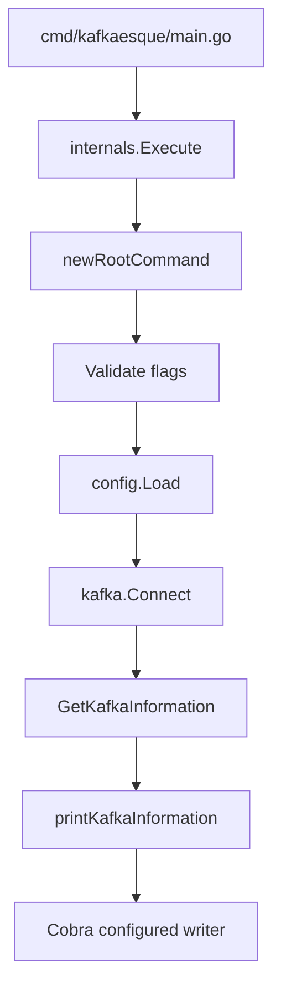
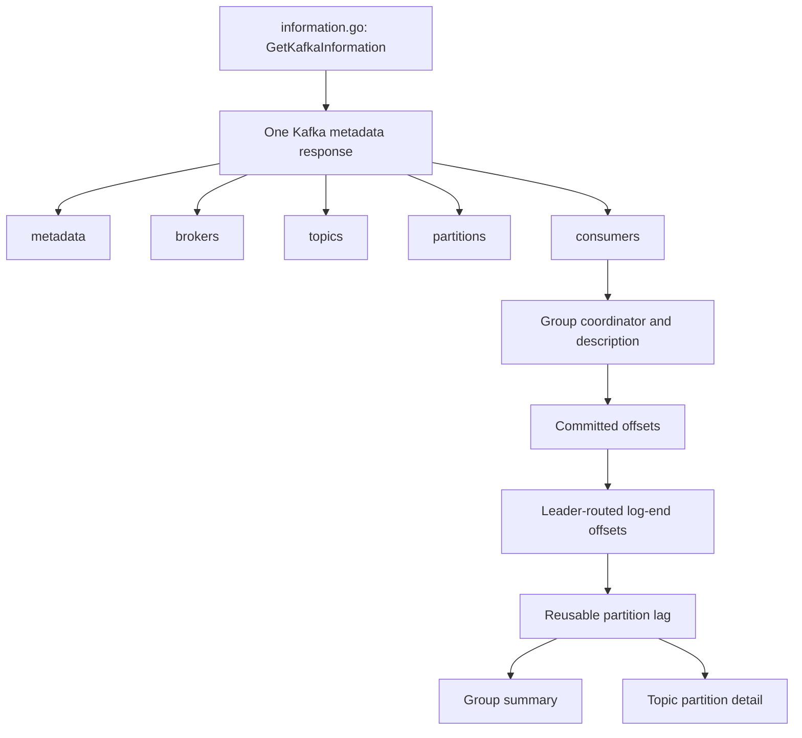

# Contributing to Kafkaesque

Thanks for helping improve Kafkaesque. The project is intentionally read-only:
features may inspect Kafka, but they must not mutate cluster state.

## Prerequisites

- Git
- Make
- The Go version declared in [`go.mod`](go.mod)
- Docker with Docker Compose for Kafka integration work
- GoReleaser v2 only when testing release artifacts

## Clone and build

```sh
git clone https://github.com/nikhil25803/kafkaesque.git
cd kafkaesque
go mod download
make build
./bin/kafkaesque --help
```

## Run the checks

Run the same core checks used by CI:

```sh
go test ./...
go vet ./...
git diff --check
```

`make test` is available as a shorter local test command. Release-related
changes should also run:

```sh
make release-test
```

## Local Kafka development

Start and seed the disposable five-broker fixture:

```sh
make kafka-up
make build
./bin/kafkaesque --config kafka-env/kafkaesque.yaml --metadata
```

Start the activity simulator when working on consumer groups or lag:

```sh
make kafka-simulator-start
./bin/kafkaesque --config kafka-env/kafkaesque.yaml --consumers
./bin/kafkaesque --config kafka-env/kafkaesque.yaml --consumer --group order-processor
```

Inspect the simulator and stop it without stopping Kafka:

```sh
make kafka-simulator-status
make kafka-simulator-logs
make kafka-simulator-stop
```

Reset or remove the complete environment:

```sh
make kafka-reset
make kafka-down
```

See [`kafka-env/README.md`](kafka-env/README.md) for the fixture matrix and
direct Compose commands.

## How the CLI works

### Command execution



`root.go` owns Cobra, validation, configuration, and connection lifecycle.
`information.go` collects structured results. `output.go` renders those results
without performing Kafka requests.

### Information collection



Combined information flags reuse the native metadata response. Consumer lag
uses committed offsets from the group coordinator and log-end offsets from each
partition leader.

## Project layout

| Path                                                       | Responsibility                                           |
| ---------------------------------------------------------- | -------------------------------------------------------- |
| `cmd/kafkaesque`                                           | Process entry point.                                     |
| `internals/root.go`                                        | CLI flags, validation, config, and connection lifecycle. |
| `internals/information.go`                                 | Shared collection and request coordination.              |
| `internals/output.go`                                      | Writer-based terminal rendering.                         |
| `internals/config`                                         | YAML, environment precedence, and validation.            |
| `internals/kafka`                                          | Kafka connection and native metadata access.             |
| `internals/{metadata,brokers,topics,partitions,consumers}` | Domain-specific structured results.                      |
| `kafka-env`                                                | Local Kafka fixture and activity simulator.              |
| `.github/workflows`                                        | Build, tests, integration, and release automation.       |
