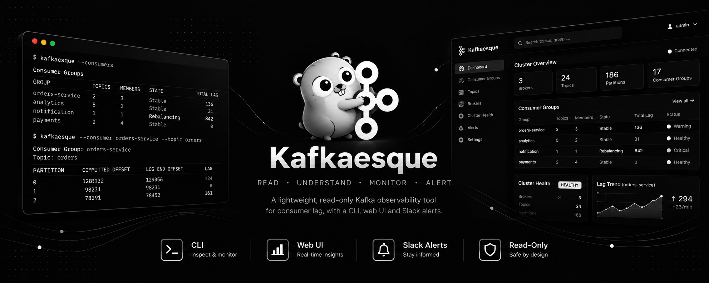

<p align="center">
  
</p>

<h1 align="center">Kafkaesque</h1>

<p align="center">
  A lightweight, read-only Kafka cluster inspector.<br>
  Understand your cluster without changing it.
</p>

<p align="center">
  <a href="https://github.com/nikhil25803/kafkaesque/actions/workflows/ci.yml"></a>
  <a href="https://github.com/nikhil25803/kafkaesque/actions/workflows/tests.yml"></a>
  <a href="https://github.com/nikhil25803/kafkaesque/actions/workflows/kafka-integration.yml"></a>
  <a href="LICENSE"></a>
</p>



## Table of contents

- [Install](#install)
- [Flags](#flags)
- [Upcoming releases](#upcoming-releases)
- [Combining flags](#combining-flags)
- [Build from source](#build-from-source)
- [Configuration](#configuration)
- [Local Kafka environment](#local-kafka-environment)
- [Command documentation](DOCS.md)
- [Contributing](CONTRIBUTING.md)
- [License](#license)

## Install

### Linux and macOS

The installer detects your platform, verifies the release checksum, and installs
Kafkaesque into `~/.local/bin` without `sudo`.

```sh
curl -fsSL https://raw.githubusercontent.com/nikhil25803/kafkaesque/main/install.sh | sh
```

```sh
export PATH="$HOME/.local/bin:$PATH"
```

```sh
kafkaesque --help
```

<details>
<summary><code>kafkaesque: command not found</code></summary>

The installer places Kafkaesque in `~/.local/bin`. Add it to the current shell:

```sh
export PATH="$HOME/.local/bin:$PATH"
```

Persist the change for Bash:

```sh
echo 'export PATH="$HOME/.local/bin:$PATH"' >> "$HOME/.bashrc"
source "$HOME/.bashrc"
```

Or for Zsh:

```sh
echo 'export PATH="$HOME/.local/bin:$PATH"' >> "$HOME/.zshrc"
source "$HOME/.zshrc"
```

</details>

<details>
<summary>Windows PowerShell installation</summary>

Download and run the checksum-verifying installer:

```powershell
curl.exe -fsSLo install.ps1 https://raw.githubusercontent.com/nikhil25803/kafkaesque/main/install.ps1
```

```powershell
powershell -ExecutionPolicy Bypass -File .\install.ps1
```

Open a new terminal, then verify the installation:

```powershell
kafkaesque --help
```

</details>

<details>
<summary>Install a specific version</summary>

Both installers use the latest release by default. Pin a release when needed:

```sh
curl -fsSL https://raw.githubusercontent.com/nikhil25803/kafkaesque/main/install.sh | VERSION=v0.1.1 sh
```

```powershell
powershell -ExecutionPolicy Bypass -File .\install.ps1 -Version v0.1.1
```

</details>

## Flags

### General

| Short | Long        | Value | Description                            | Example                |
| ----- | ----------- | ----- | -------------------------------------- | ---------------------- |
| `-v`  | `--version` | —     | Show the installed Kafkaesque version. | `kafkaesque --version` |
| `-h`  | `--help`    | —     | Show command help.                     | `kafkaesque --help`    |

### Checks and configuration

| Short | Long       | Value                       | Description                                          | Example                                               |
| ----- | ---------- | --------------------------- | ---------------------------------------------------- | ----------------------------------------------------- |
| —     | `--check`  | optional `config` or `conn` | Validate configuration or test the Kafka connection. | `kafkaesque --check`                                  |
| —     | `--config` | path                        | Load an explicit YAML configuration file.            | `kafkaesque --config /path/to/config.yaml --metadata` |

### Information

| Short | Long           | Value | Description                                              | Example                                                        |
| ----- | -------------- | ----- | -------------------------------------------------------- | -------------------------------------------------------------- |
| `-m`  | `--metadata`   | —     | Show cluster metadata and connection status.             | `kafkaesque --metadata`                                        |
| `-b`  | `--brokers`    | —     | List Kafka brokers.                                      | `kafkaesque --brokers`                                         |
| `-t`  | `--topics`     | —     | List Kafka topics.                                       | `kafkaesque --topics`                                          |
| `-p`  | `--partitions` | —     | List partitions for the topic selected by `--topic`.     | `kafkaesque --partitions --topic orders`                       |
| `-c`  | `--consumers`  | —     | List consumer groups.                                    | `kafkaesque --consumers`                                       |
| —     | `--consumer`   | —     | Inspect the consumer group selected by `--group`.        | `kafkaesque --consumer --group order-processor`                |
| —     | `--group`      | name  | Select a consumer group.                                 | `kafkaesque --consumer --group order-processor`                |
| —     | `--topic`      | name  | Select a topic for partition or consumer lag inspection. | `kafkaesque --consumer --group order-processor --topic orders` |

See [Command documentation](DOCS.md) for complete examples and representative
output.

## Upcoming releases

| Version | Release Info                                  | Status      |
| ------- | --------------------------------------------- | ----------- |
| v0.0.1  | Kafka Cluster Inspector                       | Released    |
| v0.1.0  | Consumer Groups & Partition Lag               | Released    |
| v0.1.1  | Broker Address Overrides & Version Flag       | Released    |
| v0.2.0  | Kafka Connectivity & Authentication           | Coming Soon |
| v0.3.0  | Deep Consumer Observability                   | Coming Soon |
| v0.4.0  | Cluster Health & Diagnostics                  | Coming Soon |
| v0.5.0  | CLI UX & Structured Output                    | Coming Soon |
| v0.6.0  | Watch Mode & Lag Trends                       | Coming Soon |
| v0.7.0  | HTMX Web UI                                   | Coming Soon |
| v0.8.0  | Web Authentication                            | Coming Soon |
| v0.9.0  | Slack Alerts & Production Hardening           | Coming Soon |
| v1.0.0  | Stable Read-Only Kafka Observability Platform | Coming Soon |

## Combining flags

<details>
<summary>Inspect several parts of a cluster in one command</summary>

Information flags can be combined. Kafkaesque shares the Kafka metadata request
between them and prints each requested section in a stable order.

```sh
kafkaesque --metadata --brokers --topics
```

```sh
kafkaesque --metadata --partitions --topic orders
```

Consumer list and consumer detail modes are intentionally separate, so
`--consumers` cannot be combined with `--consumer`.

</details>

## Build from source

Kafkaesque requires the Go version declared in `go.mod`.

```sh
git clone https://github.com/nikhil25803/kafkaesque.git
cd kafkaesque
make build
./bin/kafkaesque --help
```

See [CONTRIBUTING.md](CONTRIBUTING.md) for tests, architecture, and the complete
development workflow.

## Configuration

<details>
<summary>Bootstrap server, YAML paths, environment override, and lag thresholds</summary>

Configuration precedence is:

1. The built-in `localhost:9092` default.
2. YAML from the platform default path or the file selected by `--config`.
3. The `KAFKAESQUE_BOOTSTRAP_SERVER` environment variable.

```yaml
kafka:
  bootstrap_servers:
    - localhost:9092
  connection_timeout: 10s

lag:
  warning_threshold: 100
  unhealthy_threshold: 500
```

| Platform | Default path                                                                    |
| -------- | ------------------------------------------------------------------------------- |
| Linux    | `$XDG_CONFIG_HOME/kafkaesque/config.yaml` or `~/.config/kafkaesque/config.yaml` |
| macOS    | `~/Library/Application Support/kafkaesque/config.yaml`                          |
| Windows  | `%AppData%\kafkaesque\config.yaml`                                              |

Lag up to the warning threshold is `HEALTHY`, lag above it is `WARNING`, and
lag above the unhealthy threshold is `UNHEALTHY`. The warning threshold must
be lower than the unhealthy threshold.

See [`kafkaesque.example.yaml`](kafkaesque.example.yaml) for a ready-to-copy
configuration. Kafkaesque never creates configuration files automatically.

`bootstrap_server` remains supported for existing configurations. New
configurations can use `bootstrap_servers` for multiple seed brokers; setting
both forms is invalid. `connection_timeout` controls TCP, TLS, and SASL setup
and defaults to `10s`.

### TLS and SASL authentication

Kafkaesque supports TLS server verification, mutual TLS, SASL PLAIN,
SCRAM-SHA-256, and SCRAM-SHA-512. TLS uses the system certificate pool when
`ca_file` is omitted. Relative certificate paths are resolved from the
configuration file directory.

```yaml
kafka:
  bootstrap_servers:
    - kafka-1.example.com:9093
    - kafka-2.example.com:9093
  security:
    tls:
      enabled: true
      ca_file: certificates/ca.pem
      # Include both fields when the broker requires mutual TLS.
      client_cert_file: certificates/client.pem
      client_key_file: certificates/client-key.pem
      server_name: kafka.example.com
    sasl:
      mechanism: SCRAM-SHA-256
      username: kafkaesque
      password: secret
```

A SASL mechanism enables authentication automatically. Combining it with
`tls.enabled: true` selects `SASL_SSL`; without TLS it selects
`SASL_PLAINTEXT`. Do not use PLAIN without TLS on an untrusted network because
PLAIN credentials are not encrypted.

OAuth/OIDC, Kerberos/GSSAPI, AWS MSK IAM, and other provider-specific
mechanisms are not currently supported.

### Broker address overrides

Some Kafka clusters advertise internal broker addresses even though clients
connect through one external load balancer per broker. Add exact address
overrides when Kafkaesque can reach the external listeners but cannot resolve
or connect to the advertised addresses:

```yaml
kafka:
  bootstrap_server: 10.100.0.72:9094
  broker_address_overrides:
    "broker-0.broker-headless.kafka-connect.svc.cluster.local:9092": "10.100.0.72:9094"
    "broker-1.broker-headless.kafka-connect.svc.cluster.local:9092": "10.100.0.74:9094"
    "broker-2.broker-headless.kafka-connect.svc.cluster.local:9092": "10.100.0.73:9094"
```

Overrides apply to consumer coordinators and partition leaders as well as
general broker requests. Each destination must route to the corresponding
broker; do not map multiple brokers to a non-sticky shared load balancer.
Kafkaesque shows both advertised and connect addresses in `--brokers` output
when an override is active.

Correct Kafka `advertised.listeners` configuration is preferred when you
control the cluster. Overrides are intended for environments where changing
the broker configuration is not practical.

</details>

## Local Kafka environment

<details>
<summary>Run the disposable five-broker development cluster</summary>

The repository includes a plaintext Kafka fixture on `localhost:9090` with
seeded topics, partitions, records, and consumer groups.

```sh
make kafka-up
```

```sh
KAFKAESQUE_BOOTSTRAP_SERVER=localhost:9090 kafkaesque --metadata
```

Start the optional activity simulator to keep consumer groups active:

```sh
make kafka-simulator-start
KAFKAESQUE_BOOTSTRAP_SERVER=localhost:9090 kafkaesque --consumers
make kafka-simulator-stop
```

```sh
make kafka-down
```

See [`kafka-env/README.md`](kafka-env/README.md) for fixture contents, reset,
logs, and direct Docker Compose commands.

</details>

## Documentation

- [Command reference and sample output](DOCS.md)
- [Contributor guide and architecture](CONTRIBUTING.md)

## License

Kafkaesque is available under the [MIT License](LICENSE).
